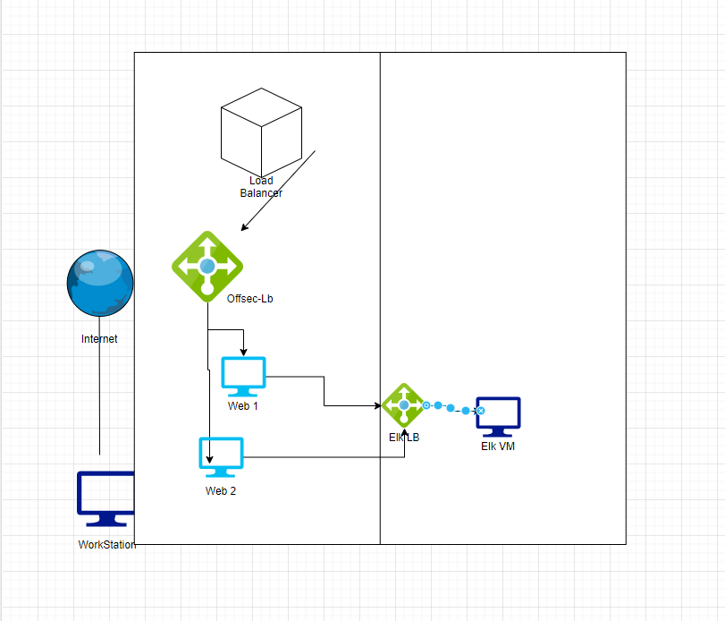

## Automated ELK Stack Deployment

The files in this repository were used to configure the network depicted below.

These files have been tested and used to generate a live ELK deployment on Azure. They can be used to either recreate the entire deployment pictured above. Alternatively, select portions of the _____ file may be used to install only certain pieces of it, such as Filebeat.

 

This document contains the following details:
- Description of the Topologu
- Access Policies
- ELK Configuration
  - Beats in Use
  - Machines Being Monitored
- How to Use the Ansible Build

### Description of the Topology

The main purpose of this network is to expose a load-balanced and monitored instance of DVWA, the D*mn Vulnerable Web Application.

Load balancing ensures that the application will be highly _____, in addition to restricting _____ to the network.
- _TODO: What aspect of security do load balancers protect? What is the advantage of a jump box?_

Integrating an ELK server allows users to easily monitor the vulnerable VMs for changes to the _____ and system _____.
    Filebeat monitors the log files or locations specified, collects log events, and forwards them either to Elasticsearch or Logstash for indexing.

   Metricbeat is an extremely easy-to-use, efficient and reliable metric shipper for monitoring your system and the processes running on it. The configuration details of each 
   machine may be found below.

The configuration details of each machine may be found below.
_Note: Use the [Markdown Table Generator](http://www.tablesgenerator.com/markdown_tables) to add/remove values from the table_.

| Name       | Function   | Ip Address | Operating System |
|------------|------------|------------|------------------|
| Jump-Box   | Gateway    | 10.0.0.8   | Linux            |
| Web 1      | Server     | 10.0.0.9   | Linux            |
| Web 2      | Server     | 10.0.0.10  | linux            |
| Elk Server | Monitoring | 10.2.0.4   | Linux            |

### Access Policies

The machines on the internal network are not exposed to the public Internet. 

Only the Jump Box machine can accept connections from the Internet. Access to this machine is only allowed from the following IP addresses:
-5061 Kibana port

Machines within the network can only be accessed by the Jump-Box-Provisioner.
- _TODO: Which machine did you allow to access your ELK VM? What was its IP address?_

A summary of the access policies in place can be found in the table below.

| Name       | Publicly Accessible  | Allowed IP |
|------------|----------------------|------------|
| Jump-Box   | Yes                  | 10.0.0.8   |
| Web 1      | No                   | 10.0.0.8   |
| Web 2      | No                   | 10.0.0.8   |
| Elk Server | No                   | 10.0.0.8   |

### Elk Configuration

Ansible was used to automate configuration of the ELK machine. No configuration was performed manually, which is advantageous because...
- _TODO: What is the main advantage of automating configuration with Ansible?_

The playbook implements the following tasks:
-nstall docker.io
Install python3-pip
Install docker via pip
Increase vitual memory
Use more memory
Download and launch a docker elk container - starts docker and establishes the ports being used.

### Target Machines & Beats
This ELK server is configured to monitor the following machines:
Configured to Monitor Both Web 1 Server and the Web 2 server

We have installed the following Beats on these machines:
FileBeat
MetricBeat

### Using the Playbook
In order to use the playbook, you will need to have an Ansible control node already configured. Assuming you have such a control node provisioned: 

SSH into the control node and follow the steps below:
- Copy the playbook (.yml) file to Ansible directory.
-Update the host file to include webserver and ELK..
- Run the playbook, and navigate to Kibana to check that the installation worked as expected. 
